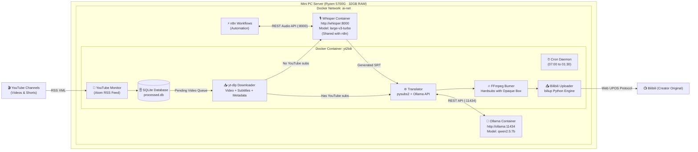

# yt2bili — YouTube to Bilibili Automation Pipeline

An autonomous, containerized automation pipeline running in Docker that monitors YouTube channels (both standard videos and Shorts without duration filtering), downloads media and subtitles, translates subtitles, titles, and descriptions into Simplified Chinese using a local Ollama instance (preserving original audio without TTS), burns translated subtitles with an opaque background box (cleanly replacing pre-existing hardsubs), and publishes content to Bilibili under creator-original copyright with automatic category matching.

Engineered specifically for local mini-PC servers (such as AMD Ryzen 5700G, 32GB RAM) running daily schedules.

---

## Table of Contents

- [Key Features](#-key-features)
- [System Architecture](#-system-architecture)
- [Deployment Tutorial (Step-by-Step)](#-deployment-tutorial-step-by-step)
  - [1. Prerequisites](#1-prerequisites)
  - [2. Clone the Repository](#2-clone-the-repository)
  - [3. Ensure Ollama Model is Downloaded](#3-ensure-ollama-model-is-downloaded)
  - [4. Deploy the Standalone Whisper Service](#4-deploy-the-standalone-whisper-service-optional-but-recommended)
  - [5. Configure YouTube Channels & Settings](#5-configure-youtube-channels--settings)
  - [6. One-Time Bilibili QR Code Login](#6-one-time-bilibili-qr-code-login)
  - [7. Start the Unattended Service](#7-start-the-unattended-service)
  - [8. Verification & Log Inspection](#8-verification--log-inspection)
- [Cookies & Authentication Guide](#-cookies--authentication-guide)
  - [1. Bilibili Cookies (cookies.json)](#1-bilibili-cookies-cookiesjson--required)
  - [2. YouTube Cookies (yt_cookies.txt)](#2-youtube-cookies-yt_cookiestxt--optional)
- [Automatic Category Mapping (YouTube → Bilibili)](#-automatic-category-mapping-youtube--bilibili)
- [Subtitle Box Styling (Covering Source Hardsubs)](#-subtitle-box-styling-covering-source-hardsubs)
- [Rate Limiting & Cooldown Protection](#-rate-limiting--cooldown-protection)
- [Configuration Reference (`config.yml`)](#-configuration-reference-configyml)
- [Troubleshooting & Maintenance](#-troubleshooting--maintenance)

---

## 🌟 Key Features

1. **Unfiltered YouTube Monitoring:**
   - Polls official YouTube Atom/RSS feeds every 30 minutes without API keys or quota consumption.
   - Ingests both standard widescreen videos and vertical Shorts without duration constraints.
2. **Local LLM Subtitle Translation (Ollama):**
   - Batches subtitles (30 lines per call) with a sliding context window for natural Chinese phrasing.
   - Timestamps are completely decoupled and preserved in Python via `pysubs2` to eliminate audio desync.
   - Uses `qwen2.5:7b`, the premier open-weights model for English/Spanish to Chinese translation.
3. **Hardcoded Subtitles with Opaque Box (`BorderStyle=3`):**
   - Automatically overlays a solid black background box (`&H00000000`) behind the Chinese characters.
   - Completely covers and replaces any pre-existing burned-in subtitles present in the source video.
   - Audio is copied losslessly (`-c:a copy`) to preserve original audio fidelity.
4. **Standalone Whisper STT Fallback (Shared with n8n):**
   - If a YouTube video lacks manual or auto-generated captions, the pipeline calls your standalone `whisper` container on `ai-net` (`http://whisper:8000/v1/audio/transcriptions`).
   - Powered by `large-v3-turbo` for state-of-the-art accuracy in both Spanish and English.
   - Fully compatible with n8n workflows through the standard OpenAI Audio API format.
5. **Dynamic Category Detection:**
   - Detects the video's native category on YouTube and maps it to the corresponding Bilibili partition TID (Gaming, Tech, Science, Entertainment, etc.).
6. **Anti-Spam Upload Cooldown (60 Minutes):**
   - Enforces a minimum 60-minute interval between consecutive uploads to prevent Bilibili risk control triggers (error code `21070`).
   - Limits processing to 1 video per run, gracefully queueing surplus videos in SQLite.
7. **Docker Network Integration (`ai-net`):**
   - Directly attaches to the existing external Docker network `ai-net` to reach Ollama at `http://ollama:11434` and Whisper at `http://whisper:8000`.
8. **Server Operating Schedule (7:00 AM – 2:00 AM):**
   - Cron daemon scheduled to run every 30 minutes between 07:00 and 01:30.
   - Persistent SQLite tracking prevents duplicate processing across daily reboots.

---

## 🏗️ System Architecture



---

## 🚀 Deployment Tutorial (Step-by-Step)

Follow these instructions to deploy the pipeline on your mini-PC server.

### 1. Prerequisites

Ensure your mini-PC server has:
- Docker and Docker Compose installed.
- The `ai-net` Docker network already created.
- The `ollama` container running and attached to `ai-net`.

### 2. Clone the Repository

On your mini-PC terminal:
```bash
git clone https://github.com/fernandor2/yt2bili.git
cd yt2bili
```

### 3. Ensure Ollama Model is Downloaded

Verify that your Ollama container has the `qwen2.5:7b` model available:
```bash
docker exec -it ollama ollama pull qwen2.5:7b
```

### 4. Deploy the Standalone Whisper Service (Optional but Recommended)

To enable Speech-to-Text fallback for videos that do not have YouTube captions (and reuse it with n8n):
```yaml
# Add to your server's docker-compose or create a whisper stack:
services:
  whisper:
    image: fedirz/faster-whisper-server:latest-cpu
    container_name: whisper
    restart: unless-stopped
    ports:
      - "8008:8000"
    environment:
      - WHISPER__MODEL=deepdml/faster-whisper-large-v3-turbo-ct2
      - WHISPER__DEVICE=cpu
      - WHISPER__COMPUTE_TYPE=int8
      - WHISPER__CPU_THREADS=4
    volumes:
      - /mnt/principal/whisper-cache:/root/.cache/huggingface
    networks:
      - ai-net

networks:
  ai-net:
    external: true
```
Launch it with `docker compose up -d`. Inside `ai-net`, it is accessible at `http://whisper:8000/v1/audio/transcriptions`.

### 5. Configure YouTube Channels & Settings

Open `config.yml` in your preferred editor:
```bash
nano config.yml
```

Add the YouTube channel IDs (`UC...`) you want to monitor:
```yaml
channels:
  - name: "My Main Channel"
    channel_id: "UCxxxxxxxxxxxxxxxxxxxxxxxxx"
  - name: "Second Channel"
    channel_id: "UCyyyyyyyyyyyyyyyyyyyyyyyyy"
```

> **How to find a YouTube Channel ID:**
> 1. Visit `https://www.youtube.com/@ChannelHandle`.
> 2. Right-click anywhere on the page and select **View Page Source**.
> 3. Search (`Ctrl+F`) for `"channelId":"UC` or use a free channel ID lookup tool.

### 6. One-Time Bilibili QR Code Login

Before running in the background, generate your persistent Bilibili credentials:

```bash
# 1. If an empty directory named 'cookies.json' was created by a previous run, remove it:
[ -d "cookies.json" ] && rm -rf cookies.json

# 2. Launch the interactive QR login
docker compose run --rm yt2bili biliup login
```

*(Alternative direct command if you wish to bypass entrypoint scripts:)*
```bash
docker compose run --rm --entrypoint biliup yt2bili -u /app/data/cookies.json login
```

- A QR code will be rendered in your terminal.
- Open the **Bilibili Mobile App** on your smartphone.
- Tap the **Scan (扫一扫)** icon in the top right corner and confirm the login.
- Once confirmed, `cookies.json` will be saved inside `./data/cookies.json` (which is permanently mounted via `./data:/app/data`). The underlying `biliup` engine automatically refreshes authentication tokens upon every upload.

### 7. Start the Unattended Service

Start the container in detached mode:

```bash
docker compose up -d
```

*(Note: Live code mounts `./src` and `./entrypoint.sh` ensure that subsequent `git pull` updates take effect immediately without having to rebuild the container).*

### 8. Verification & Log Inspection

Watch the execution logs in real time:
```bash
docker compose logs -f yt2bili
```

To manually trigger an immediate check outside the cron schedule:
```bash
docker compose exec yt2bili python -u /app/src/main.py
```

---

## 🍪 Cookies & Authentication Guide

### 1. Bilibili Cookies (`cookies.json`) — Required

Bilibili requires an authenticated session to publish videos.

- **How to obtain them:**
  Run the interactive terminal login inside the container:
  ```bash
  docker compose run --rm yt2bili biliup login
  ```
  A QR code will be rendered in your console. Open the **Bilibili App** on your smartphone, tap the **Scan (扫一扫)** icon in the top-right corner, and confirm the login request.
- **Where to put them:**
  The login command creates `cookies.json` automatically inside the `data/` directory (`yt2bili/data/cookies.json`). Because `./data` is mounted into the container, it persists across restarts and server reboots.
- **Persistence & Automatic Token Refresh:**
  The underlying `biliup` engine automatically refreshes authentication tokens upon every upload, so you never need to re-login unless your Bilibili account password is changed or the session is revoked.

---

### 2. YouTube Cookies (`yt_cookies.txt`) — Optional

`yt2bili` uses Chrome TLS impersonation (`curl-cffi`) and mobile player clients, so YouTube cookies are **not** needed under normal conditions. However, if YouTube ever challenges your server's public IP address with bot verification, age restrictions, or bandwidth throttling, providing your YouTube cookies solves it immediately.

- **How to obtain them:**
  1. Open Google Chrome, Firefox, Brave, or Edge on your personal computer where you are logged into your YouTube account.
  2. Install a browser extension that exports cookies in standard Netscape format:
     - Recommended (Open-Source): **[Get cookies.txt LOCALLY](https://github.com/kairi003/Get-cookies.txt-LOCALLY)** (available on Chrome Web Store and Firefox Add-ons).
     - Alternative: **[Cookie-Editor](https://cookie-editor.com/)** (Click *Export* → *Export as Netscape*).
  3. Navigate to `https://www.youtube.com`.
  4. Click the extension icon and click **Export** (or download the file).
  5. Rename the downloaded file to `yt_cookies.txt`.
- **Where to put them:**
  Save the file inside the `data/` directory of the `yt2bili` project on your server:
  ```text
  yt2bili/data/yt_cookies.txt
  ```
- **Auto-Detection:**
  `yt2bili` automatically checks for `./data/yt_cookies.txt` on every run. If present, it routes all `yt-dlp` requests through your authenticated YouTube session. If absent, it smoothly falls back to Chrome impersonation.

---

## 🏷️ Automatic Category Mapping (YouTube → Bilibili)

The pipeline automatically inspects each video's native YouTube category and translates it into the appropriate Bilibili partition TID:

| YouTube Category | Bilibili Partition Name | Bilibili TID |
| :--- | :--- | :---: |
| **Gaming** | Single-player Games (单机游戏) | `17` |
| **Science & Technology** | Technology & Digital (数码) | `188` |
| **Education** | Science & Knowledge (科学科普) | `201` |
| **Film & Animation** | Animation Comprehensive (综合动画) | `27` |
| **Entertainment** | Entertainment Comprehensive (娱乐综合) | `71` |
| **Comedy** | Comedy & Humor (搞笑) | `138` |
| **Music** | Music Comprehensive (音乐综合) | `130` |
| **Sports** | Sports Comprehensive (运动综合) | `234` |
| **Autos & Vehicles** | Automobiles Comprehensive (汽车综合) | `176` |
| **Pets & Animals** | Pets & Animals (动物圈) | `217` |
| **Travel & Events** | Daily Life & Travel (日常) | `21` |
| **People & Blogs** | Daily Life (日常) | `21` |
| **Howto & Style** | Crafts & Lifestyle (手工) | `161` |
| **News & Politics** | Hot Topics & News (热点) | `204` |

You can customize or override any of these mappings inside `config.yml`:
```yaml
bilibili:
  category_mapping:
    "Gaming": 171  # Redirect gaming videos to eSports (电子竞技)
```

---

## 📦 Subtitle Box Styling (Covering Source Hardsubs)

If your source YouTube videos already contain burned-in English or Spanish subtitles, rendering plain text on top creates an unreadable overlap.

`yt2bili` uses **FFmpeg ASS `BorderStyle=3`**, creating an opaque bounding box:
- **Box Fill (`box_color`):** `&H00000000` (100% solid black).
- **Text (`text_color`):** `&H00FFFFFF` (crisp pure white).
- **Font:** `Noto Sans CJK SC` (installed inside the container image).
- **Padding (`box_padding`):** `4px` padding around characters for clean margins.
- **Vertical Margin (`margin_v`):** `30px` from the bottom edge.

This produces the clean, professional subtitle bar standard used by Chinese localization groups (*字幕组*).

---

## ⏱️ Rate Limiting & Cooldown Protection

Bilibili enforces anti-spam risk control (*风控*). If an automated tool submits several videos in rapid succession, Bilibili rejects requests with error code `21070` (*Submissions too frequent*).

To prevent this:
1. **Persistent Timestamp Tracking:** The exact UTC timestamp of each successful upload is stored in SQLite (`metadata` table).
2. **60-Minute Cooldown (`upload_cooldown_minutes: 60`):** If a cron execution runs while an upload occurred less than 60 minutes ago, the pipeline logs the remaining wait time and exits safely.
3. **Queue Processing (`max_uploads_per_run: 1`):** Only 1 video is uploaded per cycle. If a channel posts multiple videos at once, they are safely queued in SQLite and published one by one across subsequent hourly runs.

---

## ⚙️ Configuration Reference (`config.yml`)

```yaml
# Monitored YouTube channels
channels:
  - name: "Channel Name"
    channel_id: "UCxxxxxxxxxxxxxxxxxxxxxxxxx"
    # tid: 17 # Optional: force a specific Bilibili category for this channel

bilibili:
  tid: 17 # Default fallback category
  category_mapping: # YouTube -> Bilibili category mappings
    "Gaming": 17
    "Science & Technology": 188
    # ...
  copyright: 1 # 1 = Creator Original (自制 - Recommended), 2 = Reprint (转载)
  tags: "原创,翻译,中文字幕" # Video tags (comma-separated, max 12)
  cookie_file: "/app/cookies.json" # Path to credentials file

translation:
  ollama_host: "http://ollama:11434" # Ollama endpoint in ai-net
  model: "qwen2.5:7b" # Model identifier
  batch_size: 30 # Lines translated per LLM prompt
  temperature: 0.3 # Generation temperature

subtitles:
  source_langs: ["en.*", "es.*", "en", "es"]
  burn_in: true # Burn hardsubs into video
  border_style: 3 # 3 = Opaque background box (covers existing subs)
  box_padding: 4 # Box padding in pixels
  margin_v: 30 # Vertical margin from bottom
  font_name: "Noto Sans CJK SC"
  font_size: 20
  ffmpeg_preset: "faster" # Encoding speed preset
  ffmpeg_crf: 20 # Constant Rate Factor (18-23)

pipeline:
  upload_cooldown_minutes: 60 # Cooldown between uploads (minutes)
  max_uploads_per_run: 1 # Maximum uploads per cycle
  download_dir: "/app/data/downloads"
  db_path: "/app/data/db/processed.db"
  cleanup_after_upload: true # Delete downloaded video after upload
  max_file_size_gb: 8 # Maximum video size allowed
```

---

## 🔧 Troubleshooting & Maintenance

### How to re-authenticate if cookies expire
Run the interactive login command again:
```bash
docker compose run --rm yt2bili biliup login
```

### Inspecting processing history and database
To view processed video statuses directly from SQLite:
```bash
docker compose exec yt2bili sqlite3 /app/data/db/processed.db "SELECT video_id, title, status, updated_at FROM processed_videos;"
```

### Handling daily 7:00 AM – 2:00 AM server power cycles
No manual intervention is required.
- The container is configured with `restart: unless-stopped`. When your mini-PC powers on at 7:00 AM, Docker brings `yt2bili` up automatically.
- State is preserved in `./data/db/processed.db`, guaranteeing that videos are neither duplicated nor forgotten.

### YouTube Quality Protection & Anti-Throttling

YouTube frequently challenges web downloaders with bot detection, SABR format throttling (downgrading to 360p), or HTTP 403 errors. `yt2bili` implements 4 layers of defense:

1. **Unrestricted Stream Remuxing:**
   Instead of demanding legacy MP4 streams (which YouTube often only provides at 360p/720p), `yt-dlp` fetches the highest quality stream available (VP9, AV1, or AVC up to 1080p) and FFmpeg automatically remuxes it cleanly into MP4.
2. **Mobile Client Emulation:**
   The downloader rotates through `android` and `ios` player clients. Mobile clients bypass Google's web bot-detection challenges, bypass SABR 403 errors, and stream 1080p without requiring web browser cookies.
3. **Automatic `yt-dlp` Upgrades on Startup:**
   Whenever the server powers on at 7:00 AM, `entrypoint.sh` automatically checks for and installs the latest `yt-dlp` release, preventing sudden breakages caused by YouTube player changes.
4. **Optional YouTube Cookies (`yt_cookies.txt`):**
   If YouTube ever imposes strict IP challenges on your server's public IP:
   - Export your YouTube cookies in standard Netscape format using a browser extension (such as *Get cookies.txt LOCALLY*).
   - Save the file as `./data/yt_cookies.txt` on your mini PC.
   - The container automatically detects this file and routes requests through your authenticated session.
   