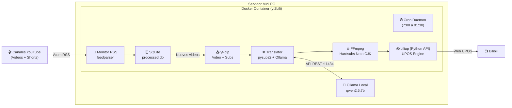

# yt2bili — YouTube to Bilibili Automation Pipeline

Pipeline automatizado y desatendido en Docker para monitorizar canales de YouTube (vídeos normales y Shorts sin filtrar por duración), descargar contenido y subtítulos, traducir los subtítulos, título y descripción al chino mediante Ollama local (manteniendo el audio original intacto), quemar los subtítulos y publicarlo en Bilibili.

Diseñado para ejecutarse en servidor local / mini PC (e.g. Ryzen 5700G, 32GB RAM).

---

## 🏗️ Arquitectura del Sistema



---

## 🚀 Despliegue en el Servidor (Paso a Paso)

### 1. Clonar el repositorio
```bash
git clone https://github.com/fernandor2/yt2bili.git
cd yt2bili
```

### 2. Preparar el modelo en Ollama
Asegúrate de tener el modelo de traducción descargado en tu servidor:
```bash
ollama pull qwen2.5:7b
```
*(Nota: Si Ollama corre en el host Linux, asegúrate de que el contenedor puede conectar por red `host.docker.internal` o mediante la IP del host).*

### 3. Configurar tus canales
Edita el archivo `config.yml`:
```yaml
channels:
  - name: "Nombre del Canal"
    channel_id: "UCxxxxxxxxxxxxxxxxxxxxxx"
    # tid: 17 # Opcional: categoría específica de Bilibili para este canal
```

### 4. Generar sesión de Bilibili (una sola vez)
Ejecuta el contenedor una vez de forma interactiva para escanear el código QR con la app de Bilibili:
```bash
docker compose run --rm yt2bili biliup login
```
Esto generará el archivo `cookies.json` en la raíz del proyecto, que se montará de forma persistente y se renovará automáticamente en cada subida.

### 5. Iniciar el servicio desatendido
```bash
docker compose up -d
```

---

## ⚙️ Configuración (`config.yml`)

- **Categorías (`tid`) comunes de Bilibili:**
  - `17`: Single-player Games (单机游戏)
  - `171`: eSports (电子竞技)
  - `188`: Tecnología / Digital (数码)
  - `207`: Ciencia / Divulgación (科学科普)
  - `21`: Vida diaria (日常)
  - `122`: Tecnología Geek (野生技协)
- **Subtítulos:**
  - Hardsubs quemados directamente con FFmpeg usando la fuente `Noto Sans CJK SC`.
  - Audio original preservado intacto (`-c:a copy`).
- **Traducción:**
  - Traduce en bloques (batches) de 30 líneas con ventana deslizante de contexto.
  - Nunca envía marcas de tiempo al LLM para garantizar 100% de sincronización.
