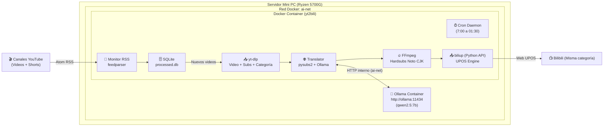

# yt2bili — YouTube to Bilibili Automation Pipeline

Pipeline automatizado y desatendido en Docker para monitorizar canales de YouTube (vídeos normales y Shorts sin filtrar por duración), descargar contenido y subtítulos, traducir los subtítulos, título y descripción al chino mediante Ollama local (manteniendo el audio original intacto), quemar los subtítulos y publicarlo en Bilibili con la misma categoría de YouTube.

Diseñado para ejecutarse en servidor local / mini PC (e.g. Ryzen 5700G, 32GB RAM).

---

## 🏗️ Arquitectura del Sistema



---

## 🚀 Despliegue en el Servidor (Paso a Paso)

### 1. Clonar el repositorio
```bash
git clone https://github.com/fernandor2/yt2bili.git
cd yt2bili
```

### 2. Verificar modelo en Ollama
Asegúrate de que el contenedor de Ollama tiene descargado el modelo:
```bash
docker exec -it ollama ollama pull qwen2.5:7b
```

### 3. Configurar tus canales
Edita el archivo `config.yml`:
```yaml
channels:
  - name: "Nombre del Canal"
    channel_id: "UCxxxxxxxxxxxxxxxxxxxxxx"
```

### 4. Generar sesión de Bilibili (una sola vez)
Ejecuta el contenedor de forma interactiva para escanear el código QR con la app de Bilibili:
```bash
docker compose run --rm yt2bili biliup login
```
Esto generará `cookies.json` en la raíz del proyecto, que se mantendrá persistente y se renovará automáticamente en cada subida.

### 5. Iniciar el servicio desatendido
```bash
docker compose up -d
```

---

## 🏷️ Detección Automática de Categorías (YouTube → Bilibili)

El sistema lee la categoría de YouTube de cada vídeo individual y la traduce a su partición correspondiente en Bilibili (`tid`):

| Categoría YouTube | Partición Bilibili (`tid`) | Subcategoría Bilibili |
|:---|:---:|:---|
| **Gaming** | `17` | 单机游戏 (Juegos individuales) |
| **Science & Technology** | `188` | 数码/科技 (Tecnología y digital) |
| **Education** | `201` | 科学科普 (Ciencia y divulgación) |
| **Film & Animation** | `27` | 综合 (Animación general) |
| **Entertainment** | `71` | 娱乐综合 (Entretenimiento) |
| **Comedy** | `138` | 搞笑 (Comedia / Humor) |
| **Music** | `130` | 音乐综合 (Música) |
| **Sports** | `234` | 运动综合 (Deportes) |
| **Autos & Vehicles** | `176` | 汽车综合 (Motor y vehículos) |
| **Pets & Animals** | `217` | 动物圈综合 (Mascotas y animales) |
| **Travel & Events** | `21` | 日常 (Vida cotidiana / Viajes) |
| **People & Blogs** | `21` | 日常 (Vida cotidiana) |
| **Howto & Style** | `161` | 手工 (Bricolaje / Estilo) |
| **News & Politics** | `204` | 热点 (Noticias de actualidad) |

> Puedes personalizar o anular cualquiera de estos mapeos en la sección `category_mapping` de `config.yml`, o forzar un `tid` específico para un canal concreto si lo prefieres.
